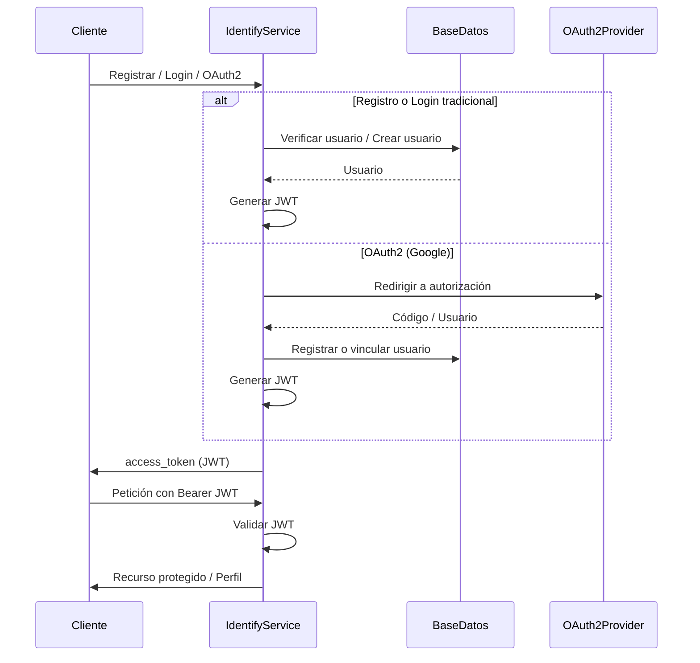

> **Advertencia**  
> Este repositorio se encuentra en **fase beta**. Su desarrollo posterior forma parte de un **proyecto privado**.

---

# Identify Service - Servicio de Identidad y Autenticación

### [Autor o equipo del proyecto]

# Contexto

Una aplicación o ecosistema de microservicios necesita un punto centralizado para gestionar la identidad y la autenticación de usuarios. El sistema debe permitir el registro de usuarios, el inicio de sesión con credenciales propias, la autenticación mediante proveedores externos (OAuth2) y la emisión de tokens JWT para que el resto de servicios puedan validar las peticiones de forma segura.

# Descripción

Este proyecto es un microservicio de identidad y autenticación desarrollado con **Java** y **Spring Boot**, siguiendo los principios de una **arquitectura limpia y hexagonal** para mantener una separación clara entre las capas de dominio, aplicación e infraestructura. Expone una API REST para registro, login, validación de tokens y endpoints protegidos, además de soporte para OAuth2 con proveedores como Google.

## Identify Service

Es el microservicio encargado de:

- **Registro** de usuarios (username, email, contraseña).
- **Login** con credenciales (username o email y contraseña).
- **Autenticación OAuth2** (por ejemplo, con Google).
- **Generación y validación** de tokens JWT.
- **Endpoints protegidos** que requieren un JWT válido (perfil, recursos protegidos, admin).

## Flujo de trabajo

- Un cliente (aplicación web, móvil u otro microservicio) necesita autenticar a un usuario.
- Puede registrarse con username, email y contraseña; o iniciar sesión con esas credenciales; o usar OAuth2 (p. ej. Google).
- Si las credenciales son correctas (o el flujo OAuth2 culmina con éxito), el servicio devuelve un **JWT**.
- El cliente incluye el JWT en las peticiones subsiguientes (header `Authorization: Bearer <token>`).
- Cualquier servicio que consulte al Identify Service puede validar el token o delegar la validación en este microservicio.



# Implementaciones y dependencias

### Lombok

El proyecto utiliza Lombok para reducir código repetitivo (getters, setters, constructores, builders) y mantener el código más limpio y legible.

### Spring Boot y Spring Security

- **Spring Boot 3.2** con **Java 17**.
- **Spring Security** para autenticación y autorización, filtros JWT y flujo OAuth2 Client.

### JWT (JSON Web Tokens)

Se usa **JJWT** para generar y validar tokens JWT. La clave secreta y la expiración se configuran en `application.properties` (por defecto `security.jwt.secret` y `security.jwt.expiration`).

### Base de datos

El proyecto utiliza una base de datos relacional para persistir usuarios y roles. Por defecto está configurado **MySQL** en `application.properties`. También se incluyen dependencias para **PostgreSQL** y **SQL Server** para facilitar el cambio de motor. La capa de persistencia está en infraestructura (JPA, repositorios, entidades).

### OAuth2

Integración con **OAuth2 Client** de Spring (p. ej. Google). Los parámetros de cliente, secreto y redirect URI se configuran en `application.properties`. El callback procesa el código y genera un JWT para el usuario autenticado por el proveedor.

### Swagger / OpenAPI

Documentación de la API con **SpringDoc OpenAPI** (Swagger UI). Disponible en `/swagger-ui.html` y especificación en `/api-docs`. Se cuenta además con un archivo `swagger-auth-endpoints.yaml` como referencia de los endpoints de autenticación.

# Calidad y pruebas

- **JUnit 5** y **Spring Boot Test** para pruebas de aplicación e integración.
- **Spring Security Test** para probar endpoints protegidos y flujos de autenticación.

# Despliegue y configuración

### Puertos

El servicio por defecto se ejecuta en el puerto **8080** (`server.port=8080` en `application.properties`).

### Variables de entorno

- **JWT_SECRET**: clave secreta para firmar los JWT (recomendado en producción). Por defecto se usa un valor en propiedades.
- Credenciales de base de datos y OAuth2 pueden externalizarse con variables de entorno o perfiles de Spring.

### Base de datos

Configurar en `application.properties` la URL, usuario y contraseña del datasource. El proyecto usa JPA con `ddl-auto=update` por defecto para desarrollo.

### OpenAPI / Swagger

Tras levantar la aplicación, la documentación interactiva está en:

- **Swagger UI**: `http://localhost:8080/swagger-ui.html`
- **OpenAPI JSON**: `http://localhost:8080/api-docs`

---

# Tabla de contenido

1. **Servicio de identidad**
   - Estructura del proyecto
   - Endpoints principales
   - Headers y autenticación
2. **Configuración**
   - Base de datos
   - JWT y OAuth2
   - Swagger

## 1. Servicio de identidad

### Estructura

El código se organiza en capas alineadas con arquitectura hexagonal:

- **domain**: entidades (`User`, `Role`), value objects (`Username`, `Email`, `Password`) y puertos de dominio (p. ej. `UserRepository`).
- **application**: servicios de aplicación (`RegisterUserService`, `LoginUserService`, `ValidateTokenService`, etc.) y puertos (`TokenProvider`, `PasswordEncoder`).
- **infrastructure**: controladores REST, seguridad (JWT, OAuth2, codificación de contraseñas), persistencia (JPA, adaptadores de repositorio) y DTOs.

### Endpoints principales

| Método | Ruta | Descripción |
|--------|------|-------------|
| POST   | `/auth/register` | Registrar nuevo usuario (username, email, password). Devuelve JWT. |
| POST   | `/auth/login`    | Login con username (o email) y contraseña. Devuelve JWT. |
| POST   | `/auth/validate` | Validar un token JWT (cuerpo con `token`). |
| GET    | `/auth/token-info` | Información del token (query `token`). |
| GET    | `/oauth2/authorization/google` | Iniciar flujo OAuth2 con Google. |
| GET    | `/login/oauth2/code/google`     | Callback OAuth2 de Google (genera JWT). |
| GET    | `/api/profile`   | Perfil del usuario autenticado (requiere JWT). |
| GET    | `/api/protected` | Recurso protegido de ejemplo (requiere JWT). |
| GET    | `/api/admin`     | Recurso de ejemplo para rol administrador (requiere JWT). |

### Headers y autenticación

Para endpoints protegidos (`/api/*`), enviar el JWT en el header:

```http
Authorization: Bearer <access_token>
```

El `access_token` se obtiene de las respuestas de `/auth/register`, `/auth/login` o del callback OAuth2.

## 2. Configuración

- **Base de datos**: `spring.datasource.*` en `application.properties` (MySQL por defecto).
- **JWT**: `security.jwt.secret`, `security.jwt.expiration`.
- **OAuth2**: `spring.security.oauth2.client.registration.google.*` (y opcionalmente otros proveedores).
- **Swagger**: `springdoc.*` (rutas de API docs y Swagger UI).

---

## About

Microservicio de identidad y autenticación para el ecosistema Flowlite. Registro, login, OAuth2 y JWT con arquitectura hexagonal en Spring Boot.
